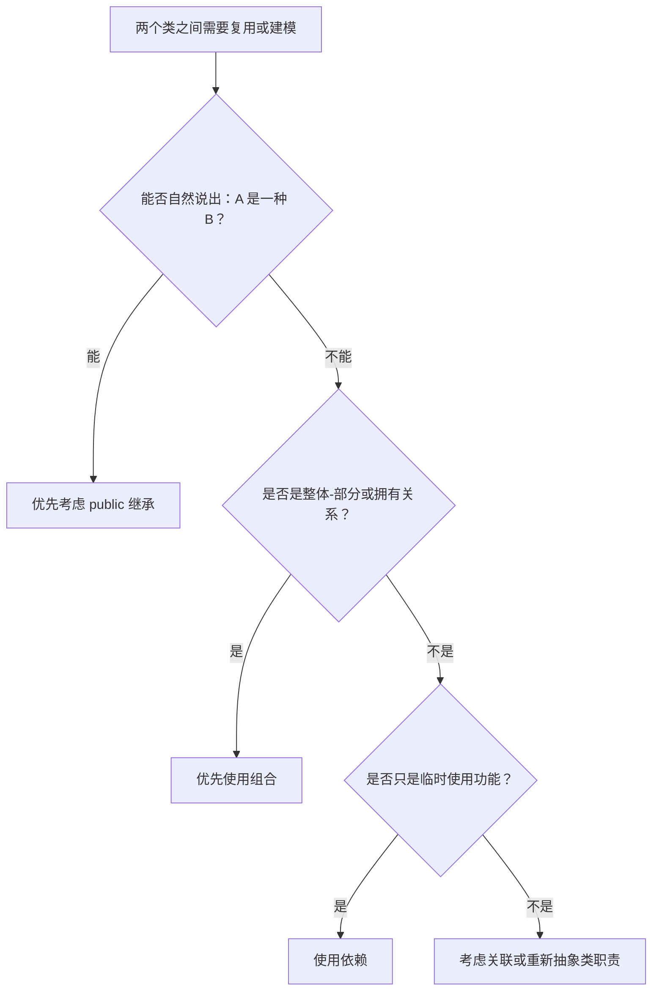

# 15.8 继承和组合的选择

本节把[[继承]]和[[组合]]放在一起比较，解决设计中最常见的问题：两个类之间到底应该建立垂直继承关系，还是水平组合关系。

## 组合的含义

[[组合]] 是类间水平关系，强调整体与部分：

```text
整体 has-a 部分
整体 contains-a 部分
```

组合有两个特点：

- 子对象所属类的源代码可以有，也可以没有；
- 复用者只需要通过接口使用子对象的功能，因此属于[[黑盒复用]]。

组合中整体对象通常负责部分对象的生存与消亡，所以它比[[聚合]]关系更强。

## 继承的含义

继承是垂直关系，属于[[白盒复用]]。不管是 public、private 还是 protected 继承，都要求基类代码对派生类可见。

三种继承方式的目的不同：

| 继承方式 | 含义 |
|---|---|
| [[公有继承]] | 表示 [[is-a关系]] |
| [[私有继承]] | 表示 [[has-a关系]]、contain-a 或 implemented-in-terms-of，通常可用组合替代 |
| [[保护继承]] | 接近私有继承，但便于保护成员在多层继承中继续传递 |

## 私有继承为什么可用组合替代

看一个例子：

```cpp
class Bike {
public:
    void move();
    void stop();
    void repair();
};

class Player : private Bike {
public:
    void startRace() {
        move();
    }

    void endRace() {
        stop();
    }
};
```

`Player` 私有继承 `Bike`，只是为了在 `startRace()`、`endRace()` 中复用 `Bike` 的 `move()`、`stop()`。但自然语言中不能说“运动员是一辆自行车”。

因此更合适的写法是组合：

```cpp
class Player {
public:
    void startRace() {
        bike.move();
    }

    void endRace() {
        bike.stop();
    }

private:
    Bike bike;
};
```

这样表达更清楚：

```text
运动员有一辆自行车
运动员使用自行车参加比赛
```

这就是[[优先组合]]原则。

## 为什么是组合而不是聚合

私有继承的效果是：基类部分完整存在于派生类对象中，派生类对象创建时基类部分也创建，派生类对象销毁时基类部分也销毁。

这更像组合，而不是聚合。

| 关系 | 生命周期含义 |
|---|---|
| 聚合 | 整体不一定负责部分的生存与消亡 |
| 组合 | 整体通常负责部分的生存与消亡 |
| 私有继承 | 基类部分随派生类对象一起构造和析构，更接近组合 |

## 设计策略：低矮继承树 + 水平关系

课程建议的设计方式是：

- 真正需要 is-a 时，使用公有继承；
- 不需要 is-a 时，尽量用组合、关联、依赖等水平关系；
- 构建多个低矮的继承树，再用水平关系把它们连接起来；
- 避免一棵又深又大的继承树。

继承层次过深会让理解和维护成本迅速上升。前面已经提到，一般三到五层足够，七到九层已经很高。

## 判断流程

可以按下面流程判断：



## 本节小结

| 场景 | 推荐选择 |
|---|---|
| 子类是一种父类 | public 继承 |
| 一个类有另一个类 | 组合 |
| 一个类临时用另一个类 | 依赖 |
| 长期持有或知道另一个对象 | 关联 |
| 只是为了复用实现 | 优先组合，谨慎使用私有继承 |
| 想让保护成员沿继承树传递 | 可考虑 protected 继承，但要谨慎 |

> [!summary] 考前速记
> 继承和组合的选择，本质是 is-a 与 has-a 的选择。能说“子类是一种父类”才用 public 继承；只能说“有一个、包含一个、借助一个”时优先组合。私有继承和保护继承大多不是首选，通常可以改为组合。
