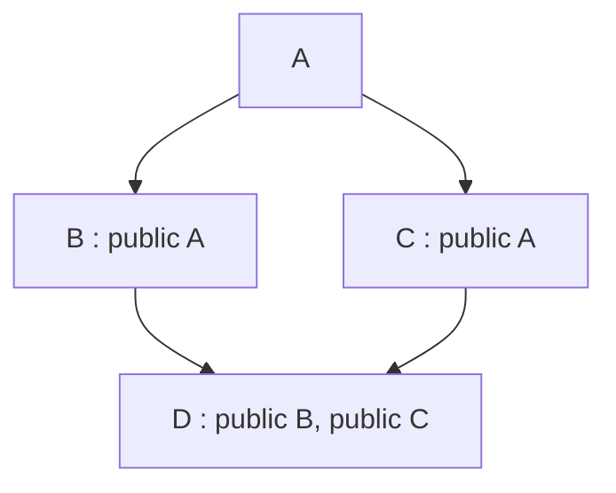

# 17.3 菱形结构

本节介绍多重继承中最典型的结构性问题：[[菱形结构]]，也称钻石结构。

## 什么是菱形结构

菱形结构指一个共同基类通过两条路径进入同一个最终派生类。



代码形式：

```cpp
class A {
public:
    void fA();
private:
    int mA;
};

class B : public A {
private:
    int mB;
};

class C : public A {
private:
    int mC;
};

class D : public B, public C {
private:
    int mD;
};
```

## 问题一：共同基类成员重复继承

`D` 从 `B` 继承一份 `A`，又从 `C` 继承一份 `A`。因此 `D` 对象中可能出现两份 `A` 的基类子对象。

```text
D 对象
├─ B 子对象
│  └─ A 子对象
├─ C 子对象
│  └─ A 子对象
└─ D 自己的数据
```

这意味着 `D` 对象里有两份 `A::mA`。

## 问题二：成员访问出现二义性

如果调用：

```cpp
D d;
d.fA();   // 二义性：从 B 那条路径来的 A::fA，还是从 C 那条路径来的 A::fA？
```

即使 `A`、`B`、`C`、`D` 中的成员名字本身都不重复，也会因为同一个共同基类从两条路径进入 `D` 而产生二义性。

可以临时用作用域限定：

```cpp
d.B::fA();
d.C::fA();
```

但这并没有解决对象中存在两份 `A` 子对象的问题。

## 菱形结构为什么比普通重名更麻烦

普通名字冲突来自两个不同基类都定义了同名成员；菱形结构的问题来自同一个共同基类被重复继承。

| 问题 | 来源 |
|---|---|
| 普通名字冲突 | `A` 和 `B` 各自有 `f` |
| 菱形结构冲突 | 同一个 `A` 经 `B` 和 `C` 两条路径进入 `D` |

因此，简单要求“各个类的成员名字不要重复”不能彻底避免菱形结构问题。

## 本节小结

菱形结构的核心是共同基类重复出现：

- `D` 中有两份 `A` 子对象；
- `A` 的成员访问可能产生二义性；
- 重复数据会占空间，也会影响类型转换和维护；
- 需要后续的[[虚基类]]或其他设计方案处理。

> [!summary] 考前速记
> 菱形结构看图记：A 在上，B/C 在中间，D 在下。D 同时经 B 和 C 得到 A，所以 D 中可能有两份 A。考试中看到 `D : public B, public C` 且 `B/C : public A`，立刻想到共同基类重复和二义性。
