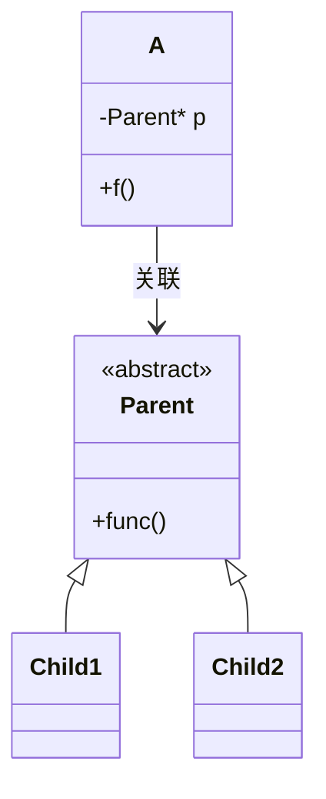
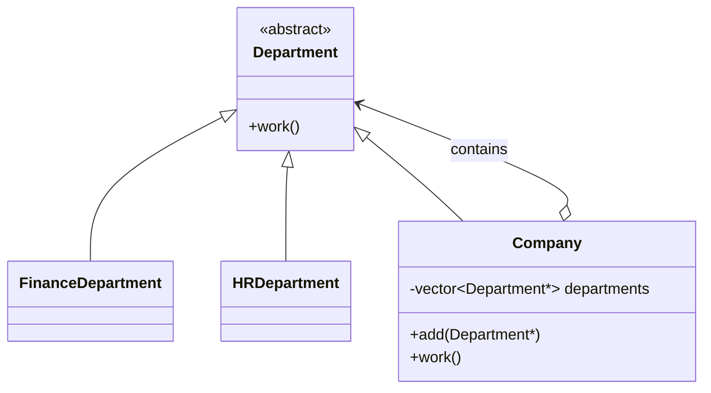

# 20.3 使用关联和继承

本节讨论[[关联]]和[[继承]]怎样配合使用。核心思想是：一个类通过数据成员关联某个父类接口，而这个父类接口背后可以接入不同派生类，从而让“被关联对象的种类变化”不影响当前类。

## 基本结构

最基本的代码形式如下：

```cpp
class Parent {
public:
    virtual ~Parent() = default;
    virtual void func() = 0;
};

class Child1 : public Parent {
public:
    void func() override;
};

class Child2 : public Parent {
public:
    void func() override;
};

class A {
public:
    explicit A(Parent* p) : p(p) {}

    void f() {
        p->func();
    }

private:
    Parent* p;
};
```

这里同时存在两种关系：

| 关系 | 代码表现 | 设计含义 |
|---|---|---|
| [[关联]] | `A` 中保存 `Parent*` 或 `Parent&` | `A` 长期拥有或使用一个 `Parent` 类型对象 |
| [[继承]] | `Child1`、`Child2` 继承 `Parent` | 具体对象种类可以变化 |

`A` 只知道 `Parent` 的接口，不需要知道实际对象是 `Parent`、`Child1`、`Child2`，还是未来新增的 `Child3`。这就是把“对象种类变化”封装在继承体系内部。



## 例一：警察、匪徒和车辆

设 `Police` 追踪 `Bandit`，追踪时需要借助一辆 `Vehicle`。车辆可能是摩托车、轿车，也可能是以后新增的其他交通工具。

```cpp
class Vehicle {
public:
    virtual ~Vehicle() = default;
    virtual int getMaxSpeed() const = 0;
};

class Motor : public Vehicle {
public:
    int getMaxSpeed() const override;
};

class Car : public Vehicle {
public:
    int getMaxSpeed() const override;
};

class Police {
public:
    explicit Police(Vehicle* vehicle) : vehicle(vehicle) {}

    bool trace(const Bandit& bandit) const {
        return vehicle->getMaxSpeed() > bandit.speed();
    }

private:
    Vehicle* vehicle;
};
```

这个设计的关键不是“警察有车”本身，而是 `Police` 只关联 `Vehicle` 抽象接口：

- 新增 `Bus`、`Helicopter` 等车辆类型时，只要继承 `Vehicle`；
- `Police` 不需要根据车辆种类写 `if` 或 `switch`；
- 原有的 `Police`、`Vehicle`、`Motor`、`Car` 都可以保持稳定。

这体现了[[封装变化]]：车辆种类变化被放到 `Vehicle` 继承体系中，警察只面向稳定接口编程。

## 例二：科学家和计算工具

设 `Scientist` 要计算圆面积。计算过程既可以自己完成，也可以交给计算器、电脑、服务器或未来的新设备完成。

```cpp
class Computer {
public:
    virtual ~Computer() = default;
    virtual double calculateArea(double radius) const = 0;
};

class DesktopComputer : public Computer {
public:
    double calculateArea(double radius) const override;
};

class Scientist {
public:
    explicit Scientist(Computer* computer) : computer(computer) {}

    double circleArea(double radius) const {
        return computer->calculateArea(radius);
    }

private:
    Computer* computer;
};
```

这里 `Scientist::circleArea()` 的实现被全部或部分交给 `Computer` 对象完成，这叫[[实现委托]]。

委托的价值在于：

- `Scientist` 只表达“我要计算面积”；
- 具体计算能力由关联对象提供；
- 以后计算设备升级，不要求改写 `Scientist`；
- 如果 `Computer` 来自旧代码、第三方库或没有源代码，也可以通过公开接口完成[[黑盒复用]]。

## 例三：篮子和水果

篮子中有多个水果，水果可以是苹果、橘子、草莓、葡萄等。

```cpp
class Fruit {
public:
    virtual ~Fruit() = default;
    virtual double weight() const = 0;
};

class Apple : public Fruit {};
class Orange : public Fruit {};

class Basket {
public:
    Basket() {
        for (int i = 0; i < 5; ++i) {
            fruits[i] = new Apple;
        }
        for (int i = 5; i < 10; ++i) {
            fruits[i] = new Orange;
        }
    }

    ~Basket() {
        for (int i = 0; i < 10; ++i) {
            delete fruits[i];
        }
    }

private:
    Fruit* fruits[10]{};
};
```

这个例子中，`Basket` 与 `Fruit` 是整体-部分关系。如果水果对象由篮子创建并销毁，这就是[[组合]]。

设计重点：

- 篮子不应该为每种水果分别保存数组；
- 篮子只需要保存 `Fruit*`；
- 新增水果类型时，只增加 `Fruit` 的派生类；
- 篮子的“装水果”结构保持不变。

图书馆和图书、书店和书、仓库和货物也有类似结构：整体包含许多部分，而部分对象可能属于不同子类型。

## 例四：派生类委托给另一个继承体系

有时某个类既是一个继承体系中的子类，又关联另一个继承体系中的对象。

```cpp
class App {
public:
    virtual ~App() = default;
    virtual void func() = 0;
};

class MobileApp : public App {
public:
    void func() override;
};

class XApp {
public:
    virtual ~XApp() = default;
    virtual void xfunc() = 0;
};

class WebApp : public App {
public:
    explicit WebApp(XApp* xapp) : xapp(xapp) {}

    void func() override {
        xapp->xfunc();
    }

private:
    XApp* xapp;
};
```

`WebApp` 从 `App` 继承，表示它是一种应用；同时它关联 `XApp`，把自己的部分实现委托给另一个对象。

这种结构常用于复用已有系统：

- `XApp` 可能来自以前的项目；
- 也可能来自第三方库；
- 只要接口稳定，`WebApp` 不需要知道 `XApp` 的内部实现。

这也是“继承负责类型扩展，关联负责功能协作”的典型用法。

## 例五：学生和同学的自关联

设 `Student` 有许多同学，而学生本身又可以继续派生出硕士生、博士生等。

```cpp
class Student {
public:
    void addClassmate(Student* student);

private:
    std::vector<Student*> classmates;
};

class MasterStudent : public Student {};
class DoctorStudent : public Student {};
```

这里有两个要点：

- `Student` 关联的是同一类体系中的对象，属于[[自关联]]；
- `classmates` 中可以放普通学生、硕士生、博士生，以及未来新增的学生子类。

这种关系说明：关联不一定发生在两个完全不同的类之间，也可以发生在同一个继承体系内部。

## 例六：公司和部门的递归组合结构

一个集团公司包含部门，也可以包含分公司；每个分公司又可以包含自己的部门和子公司。

可以把 `Company` 也看作一种特殊的 `Department`：

```cpp
class Department {
public:
    virtual ~Department() = default;
    virtual void work() = 0;
};

class FinanceDepartment : public Department {
public:
    void work() override;
};

class HRDepartment : public Department {
public:
    void work() override;
};

class Company : public Department {
public:
    void add(Department* department) {
        departments.push_back(department);
    }

    void work() override {
        for (Department* department : departments) {
            department->work();
        }
    }

private:
    std::vector<Department*> departments;
};
```

这个结构很重要：

- `FinanceDepartment`、`HRDepartment` 是叶子节点；
- `Company` 既是一个 `Department`，又包含多个 `Department`；
- 分公司可以继续包含部门和下级分公司；
- 整体形成一棵树。



这种“父类既有叶子子类，又有容器子类；容器子类再包含父类对象”的形式，是一种[[递归组合结构]]，接近常见设计模式中的[[组合模式]]。

## 本节总结

关联和继承结合时，常见思路是：

1. 找到当前类长期需要协作的对象，把它表示为数据成员；
2. 不把成员类型写成某个具体类，而写成父类接口；
3. 让具体变化通过派生类表达；
4. 当前类只依赖父类接口，避免因新增子类而修改当前类；
5. 对整体-部分关系，进一步判断应使用[[组合]]还是[[聚合]]。

考试中要特别会判断：

- 只是短暂使用参数对象，多是[[依赖]]；
- 长期保存对象引用、指针或成员，多是[[关联]]；
- 整体拥有部分，且控制生命周期，多是[[组合]]；
- 需要表达“是一种”，才使用公有继承；
- 一个类可以同时处在继承关系和关联关系中。

相关：[[20.1 Object Oriented Programming]]、[[20.2 使用依赖和继承]]、[[关联]]、[[继承]]、[[组合]]、[[实现委托]]、[[递归组合结构]]
