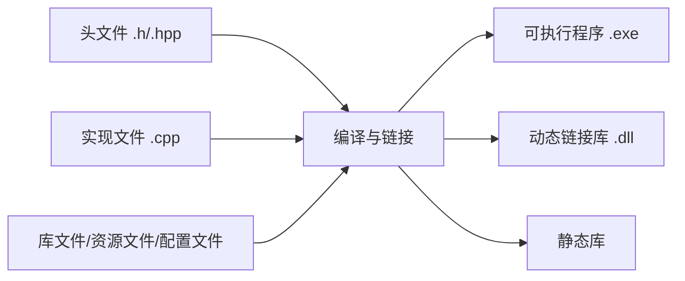
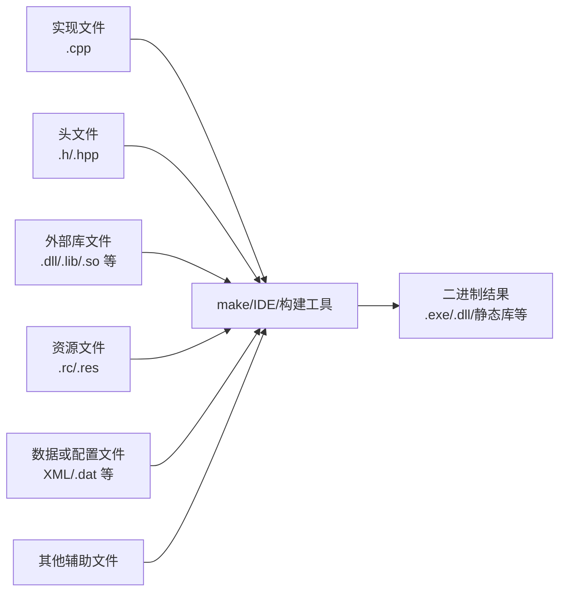

# 2.1 C++工程项目组成

## 本节核心

本节进入 C++ 基础部分，开始讲 C++ 程序和工程的组成。一个 C++ 工程通常不只是一个 `.cpp` 文件，而是由多类文件共同构成。

> [!important] 核心认识
> C++ 工程最常见、最基础的组成是[[实现文件]]和[[头文件]]；除此之外，还可能包含库文件、资源文件、配置文件、数据文件等。

理解工程组成，是后续学习编译过程、头文件、实现文件、`main` 函数和包含警戒的基础。

## C++ 工程中最核心的两类文件

课程首先强调两类最常见文件：

| 文件类型 | 常见扩展名 | 作用 |
|---|---|---|
| [[实现文件]] | `.cpp` | 存放函数、类成员函数等具体实现 |
| [[头文件]] | `.h`、`.hpp` | 存放声明、类型定义、类声明等接口信息 |

`.cpp` 文件也常称为源文件或实现文件。  
`.h` 是 C/C++ 中常见头文件扩展名，`.hpp` 通常更明确地表示 C++ 头文件。

> [!tip] 初学者理解
> 头文件更像“告诉别人有什么”，实现文件更像“具体说明怎么做”。

## 实现文件

[[实现文件]]通常包含具体代码，例如：

- 函数定义。
- 类成员函数实现。
- 程序入口 `main` 函数。
- 具体算法逻辑。

实现文件最终会参与编译，形成目标文件，再进一步链接成可执行程序或库。

## 头文件

[[头文件]]通常包含声明信息，例如：

- 函数声明。
- 类声明。
- 常量声明。
- 类型定义。
- 模板定义。

头文件用于让多个实现文件共享同一组声明，避免重复书写接口信息。

> [!warning] 易错点
> 头文件不等于“随便放代码的地方”。通常应把声明和接口放在头文件，把具体实现放在 `.cpp` 文件中；模板等特殊情况后续再单独处理。

## 工程中还可能有哪些文件

除了 `.cpp` 和头文件，一个较完整的 C++ 工程还可能包含：

- [[动态链接库]]。
- [[静态链接库]]。
- 其他可执行文件。
- [[资源文件]]。
- 数据库文件。
- 数据文件。
- 配置文件。
- 其他辅助文件。

这些文件不一定都会在本课程中深入展开，但它们是实际工程的重要组成部分。

## 库文件

库文件用于复用已经编译好或已经组织好的代码。

常见库包括：

| 类型 | 说明 |
|---|---|
| [[静态链接库]] | 编译链接时被合入最终程序 |
| [[动态链接库]] | 程序运行时或加载时被使用 |

在 Windows 中，动态链接库常见扩展名是 `.dll`。

## 资源文件

[[资源文件]]常见于图形界面程序。它们通常保存程序运行时需要的非代码资源，例如：

- 图标。
- 光标。
- 位图。
- 字符串。
- 声音。
- 动画。

本课程不重点讲图形界面，因此资源文件只作为工程背景了解。

## 数据文件和配置文件

工程中还可能有数据库文件、普通数据文件、配置文件等。

这些文件不一定参与编译，但可能影响程序运行。例如：

- 数据文件提供程序要处理的数据。
- 配置文件控制程序运行参数。
- 数据库文件保存持久化信息。

## 本课程重点关注什么

本课程主要关注：

- [[实现文件]]
- [[头文件]]
- 编译过程。
- 入口函数。
- 文件之间的包含关系。

图形资源、数据库、复杂配置等内容不是课程主线。

> [!important] 学习重点
> 先把 `.cpp`、`.h/.hpp`、编译、链接、入口函数这些基础结构弄清楚，再看更复杂的工程文件。

## 最终生成的文件

C++ 工程经过编译和链接后，会形成最终需要的二进制文件。

常见结果包括：

| 文件 | 说明 |
|---|---|
| `.exe` | 可直接运行的可执行程序 |
| `.dll` | 动态链接库，不能单独直接运行，但属于已经编译好的二进制文件 |
| 静态库 | 在链接时合入程序的库文件 |

`.dll` 通常不能直接双击运行，因为它需要由宿主程序调用。但它内部已经是机器可识别的二进制形式，因此也属于已经编译完成的程序组成部分。

> [!warning] 易错点
> “可执行文件”在广义上不只指 `.exe`。动态链接库不能独立运行，但它也是编译后的二进制文件，需要由其他程序加载和使用。

## 工程到程序的基本过程

可以把 C++ 工程理解成：

后续课程会继续讲编译过程和 Make 工具等内容。

## 图示化理解：工程不是一个 cpp 文件

从工程结构看，一个 C++ 项目更像一组材料被构建工具组织起来：

这个模型可以帮助区分三件事：

- `.cpp` 和 `.h/.hpp` 是课程最关心的源代码结构；
- 库文件、资源文件、数据文件也可能属于工程，但处理方式不同；
- 构建工具负责把这些材料按规则组织成最终结果。

> [!tip] 初学者判断
> 学 C++ 语法时容易只盯着 `.cpp`；学工程时要把 `.cpp`、头文件、库、资源、构建规则一起看。后面出现编译错误、链接错误、头文件重复包含时，都要回到这个工程模型。

## 本节考点整理

| 可能题型 | 可能问法 | 答题要点 |
|---|---|---|
| 选择题 | C++ 工程中最常见的两类源码文件是什么？ | `.cpp` 实现文件和 `.h/.hpp` 头文件 |
| 简答题 | `.cpp` 和 `.h` 有什么区别？ | `.cpp` 放具体实现，头文件放声明和接口 |
| 选择题 | 资源文件可能包含哪些内容？ | 图标、光标、位图、字符串、声音、动画等 |
| 判断题 | `.dll` 可以像 `.exe` 一样独立运行。 | 错，通常需要宿主程序加载 |
| 判断题 | 本课程主要关注图形界面资源文件。 | 错，主要关注实现文件、头文件和编译过程 |

## 本节速记

> [!summary] 速记
> C++ 工程不只是一个文件。最基础的是 `.cpp` 实现文件和 `.h/.hpp` 头文件；实际工程还可能包含库文件、资源文件、配置文件和数据文件。课程重点是实现文件、头文件和编译过程。最终结果可能是 `.exe`、`.dll` 或静态库等二进制文件。
