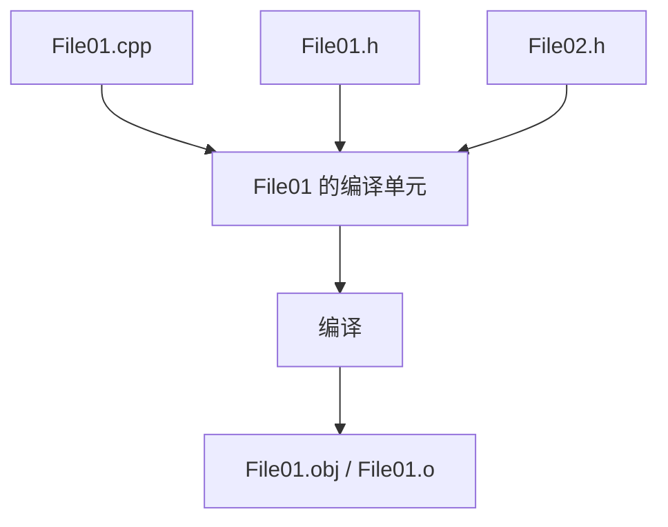
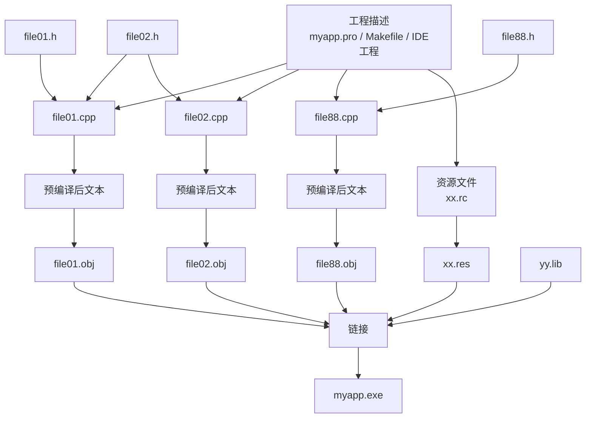

# 2.2 C++项目编译过程1

## 本节核心

本节讲 C++ 工程从多个 `.cpp` 文件到最终程序的大体编译过程。

一个 C++ 工程通常包含多个[[实现文件]]，每个实现文件先独立经过[[预编译]]和[[编译]]，形成各自的[[目标文件]]；最后再经过[[链接]]，生成最终的[[可执行文件]]或库文件。

> [!important] 核心认识
> C++ 中每个 `.cpp` 文件在编译阶段是相互独立的。不同 `.cpp` 文件真正发生联系，通常是在链接阶段。

## C++项目的基本编译流程

一个工程中可能有很多 `.cpp` 文件，例如：

- `File01.cpp`
- `File02.cpp`
- `File03.cpp`
- `File88.cpp`

每个 `.cpp` 文件大体经历：


如果工程里有多个 `.cpp` 文件，则每个文件会各自产生一个目标文件，最后这些目标文件再被链接到一起。

## 预编译、编译、链接分别做什么

| 阶段 | 输入 | 输出 | 作用 |
|---|---|---|---|
| [[预编译]] | `.cpp` 文件及其包含的头文件 | 预编译后的临时结果 | 展开头文件、处理预处理指令 |
| [[编译]] | 预编译后的代码 | [[目标文件]] | 把源代码翻译为目标代码 |
| [[链接]] | 多个目标文件、库文件、资源等 | 最终程序 | 把分散的目标文件组合成整体 |

这三个阶段是理解 C++ 工程结构的主线。

## 每个 .cpp 文件是独立编译的

课程反复强调：在链接之前，每个 `.cpp` 文件的编译过程互不相交。

也就是说：

- `File01.cpp` 编译时，不直接依赖 `File02.cpp` 的编译过程。
- `File02.cpp` 是否正在编译，不影响 `File01.cpp` 当前的编译。
- 某个 `.cpp` 文件中有语法错误，通常不会阻止另一个无关 `.cpp` 文件被单独编译。
- 多个 `.cpp` 文件的先后编译顺序，不一定固定。

> [!important] 关键术语
> 每一个 `.cpp` 文件通常是 C++ 程序编译时的一个[[编译单元]]。

## 为什么说 .cpp 是最小编译单元

[[编译单元]]可以理解为编译器一次拿来处理的一份源代码整体。

对 C++ 来说，一个 `.cpp` 文件本身不是孤立文本，它可能通过 `#include` 包含多个[[头文件]]。预编译阶段会把这些头文件内容展开进当前 `.cpp` 中，形成一个更完整的待编译文本。

因此，真正被编译器编译的不是“肉眼看到的单个 `.cpp` 文件本身”，而是：



初学时可以先简单记成：

> [!summary] 简化理解
> 一个 `.cpp` 文件加上它 `#include` 展开的所有头文件内容，构成这个 `.cpp` 对应的编译单元。

## 预编译阶段：头文件展开

一个 `.cpp` 文件可以包含多个头文件，例如：

```cpp
#include "File01.h"
#include "File02.h"

int main() {
    return 0;
}
```

在预编译阶段，编译系统会处理这些 `#include` 指令，把头文件内容展开到当前文件中。

> [!tip] 初学者理解
> `#include` 可以先理解为“把另一个文件的文本内容插入到当前位置”。这不是完整解释，但足够帮助理解本节的编译流程。

预编译后的结果通常是临时文件或中间结果，初学者在硬盘目录中不一定能直接看到它。编译器会继续拿这个结果进行后续编译。

## 编译阶段：形成目标文件

预编译结束后，编译器会把每个编译单元翻译成[[目标文件]]。

Windows 下常见目标文件扩展名是 `.obj`，类 Unix 系统下常见扩展名是 `.o`。

目标文件还不是最终可运行程序。它只是当前编译单元对应的中间结果。

例如：

| 编译单元 | 目标文件 |
|---|---|
| `File01.cpp` 及其展开内容 | `File01.obj` |
| `File02.cpp` 及其展开内容 | `File02.obj` |
| `File88.cpp` 及其展开内容 | `File88.obj` |

## 链接阶段：多个文件真正组合

当多个 `.cpp` 文件都被编译成目标文件后，链接器会把它们组合起来。

链接阶段可能处理：

- 多个 `.obj` 或 `.o` 目标文件。
- [[静态链接库]]。
- [[动态链接库]]相关导入信息。
- 资源编译后的二进制资源文件。

最终输出可能是：

- `.exe` 可执行程序。
- `.dll` 动态链接库。
- 静态库文件。

> [!important] 关键理解
> 多个 `.cpp` 文件不是在编译阶段互相“看见”的，而是在链接阶段通过目标文件组合到一起。

## 图示化理解：从工程文件到 exe

可以把一个工程的构建过程压缩成下面这张图：



这张图的关键是两条线：

- 蓝色主线可以理解为 `.cpp -> 预编译 -> 编译 -> .obj -> 链接 -> .exe`；
- 头文件不是单独生成目标文件，而是在预编译阶段被展开进使用它的 `.cpp`。

因此，同一个头文件可能被多个 `.cpp` 展开多次，但每次都属于不同编译单元。是否重复定义，要放在“同一个编译单元”和“整个程序链接”两个层面分别判断。

## 资源文件的编译

图形界面程序中还可能有[[资源文件]]，例如图标、光标、位图、声音、动画等。

资源文件也可能经过资源编译，形成二进制形式的资源结果，再参与最终链接。

本课程主线不深入图形资源，但要知道：工程中不只有源代码文件会被处理，资源文件也可能参与构建流程。

## 编译顺序不一定固定

因为每个 `.cpp` 文件独立编译，所以多个 `.cpp` 文件之间的编译先后顺序通常不是语义重点。

编译系统可能根据：

- 哪些文件被修改过。
- 哪些目标文件需要重新生成。
- 编译工具的调度策略。
- 是否启用并行编译。

来决定先编译哪个文件。

> [!warning] 易错点
> “程序运行顺序”和“.cpp 文件编译顺序”不是一回事。程序从入口函数开始运行；而工程中多个 `.cpp` 文件的编译顺序可以由构建系统安排。

## 本节和后续内容的关系

本节是理解头文件、包含警戒、声明与定义、链接错误的基础。

后面遇到这些问题时，都要回到“每个 `.cpp` 独立编译，最后统一链接”这个模型：

- 为什么头文件里通常放声明。
- 为什么同一个定义放进头文件可能导致重复定义。
- 为什么有些错误是编译错误，有些错误是链接错误。
- 为什么某个函数声明存在但实现缺失时，可能编译通过、链接失败。

## 本节考点整理

| 可能题型 | 可能问法 | 答题要点 |
|---|---|---|
| 选择题 | C++ 项目的基本构建过程包括哪些阶段？ | 预编译、编译、链接 |
| 判断题 | 多个 `.cpp` 文件在编译阶段彼此直接发生联系。 | 错，通常独立编译，链接阶段才组合 |
| 名词解释 | 什么是编译单元？ | 一个 `.cpp` 及其通过 `#include` 展开的头文件内容形成的编译整体 |
| 选择题 | `.obj` 或 `.o` 文件是什么？ | 目标文件，是编译阶段生成的中间结果 |
| 简答题 | 预编译阶段对头文件做什么？ | 处理 `#include`，把头文件内容展开进当前编译单元 |
| 判断题 | 目标文件就是最终可直接运行的程序。 | 错，目标文件还需要经过链接 |
| 简答题 | 链接阶段的作用是什么？ | 把多个目标文件、库文件、资源等组合成最终程序或库 |

## 本节速记

> [!summary] 速记
> C++ 工程中，每个 `.cpp` 文件先独立进行预编译和编译，形成自己的目标文件；不同 `.cpp` 文件通常到链接阶段才真正组合。预编译主要处理头文件展开，编译生成 `.obj/.o`，链接生成最终程序或库。
