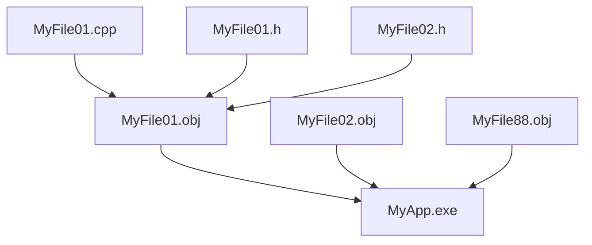

# 2.4 C++项目编译过程3

## 本节核心

本节讲 C++ 工程编译中的[[Make工具]]。前两节已经说明 C++ 项目会经历[[预编译]]、[[编译]]、[[链接]]，并且每个 `.cpp` 通常是独立的[[编译单元]]。

当工程变大后，如果每次运行都把所有 `.cpp` 文件重新编译一遍，效率会很低。Make 工具的作用，就是根据文件之间的[[依赖关系]]和[[时间戳]]判断哪些文件需要重新生成，哪些可以跳过。

> [!important] 核心认识
> Make 的基本思想是：只重新构建“受修改影响”的部分，而不是每次都把整个工程从头编译。

## 为什么需要 Make 工具

小程序通常只有一两个源文件，重新编译一次可能只需要几秒，初学时不太会感到构建成本。

但实际工程可能包含：

- 很多 `.cpp` 文件。
- 很多[[头文件]]。
- 多个库文件。
- 资源文件。
- 复杂的依赖关系。

如果每次调试都全量编译，工程越大，等待时间越长。大型工程一次完整编译可能需要很久，这会严重影响开发效率。

Make 工具就是为了提高构建效率而出现的。

## Make 工具解决什么问题

[[Make工具]]关心的问题是：

> 当前要生成某个目标文件或可执行文件时，它依赖哪些文件？这些依赖文件有没有比目标文件更新？

如果依赖文件更新了，就重新生成目标。  
如果依赖文件没变，就跳过这一部分。

例如：



如果只修改了 `MyFile01.cpp`，那么 Make 可以只重新生成 `MyFile01.obj`，再重新链接 `MyApp.exe`。其他没有受影响的目标文件可以不重新编译。

## Makefile 的基本思想

Make 工具通常根据类似[[Makefile]]的规则文件工作。

规则大体描述：

- 要生成什么目标。
- 这个目标依赖哪些文件。
- 生成目标需要执行什么命令。

可以抽象成：

```make
target: dependencies
    command
```

例如：

```make
MyApp.exe: MyFile01.obj MyFile02.obj MyFile88.obj
    link MyFile01.obj MyFile02.obj MyFile88.obj

MyFile01.obj: MyFile01.cpp MyFile01.h MyFile02.h
    c++ -c MyFile01.cpp
```

这不是本课程要求掌握的完整 Makefile 语法，只是为了理解 Make 的工作思想。

## 时间戳如何决定是否重新构建

每个文件都有[[时间戳]]，表示文件最后一次修改或生成的时间。

Make 判断是否需要重新构建时，会比较：

- 目标文件的时间戳。
- 依赖文件的时间戳。

如果某个依赖文件比目标文件更新，说明目标文件是在旧依赖基础上生成的，已经过期，需要重新生成。

> [!tip] 初学者理解
> 依赖文件比目标文件“新”，表示“目标文件没有反映最新修改”，所以要重新编译或重新链接。

## 增量编译

[[增量编译]]指只编译发生变化或受变化影响的部分。

例如一个工程有 100 个 `.cpp` 文件，如果只修改了其中 1 个 `.cpp`，那么理想情况下只需要：

1. 重新编译这个 `.cpp` 对应的目标文件。
2. 重新链接最终程序。
3. 其他 99 个目标文件保持不变。

这样可以显著缩短调试和开发过程中的等待时间。

## Make 与 Build 的区别

课程中提到，开发环境里常见两种构建方式：

| 操作 | 基本含义 | 适用场景 |
|---|---|---|
| Make | 根据依赖关系和时间戳，只构建需要更新的部分 | 日常调试、频繁修改代码 |
| [[全量编译]] / Build | 不管文件是否变化，全部重新编译 | 发布前、排除缓存问题、完整构建 |

实际不同 IDE 对菜单名称可能不同，但思想类似。

> [!warning] 易错点
> Make 不是“不编译”，而是“判断哪些地方需要编译”。该重新生成的目标仍然会重新生成。

## Make、CMake、qmake 的关系

课程中提到 Make、CMake、qmake 等工具。它们都与工程构建有关，但层次不完全一样。

| 工具 | 简要理解 |
|---|---|
| [[Make工具]] | 根据规则和时间戳执行构建 |
| [[CMake]] | 常用于生成 Makefile 或 IDE 工程文件 |
| [[qmake]] | Qt 生态中常见的工程构建配置工具 |

初学本课程时不必深入掌握这些工具的全部语法，先理解“工程构建需要描述依赖关系，并避免不必要的重复编译”即可。

## 本节和工程开发的关系

Make 工具帮助我们理解：

- 为什么修改一个头文件可能导致多个 `.cpp` 重新编译。
- 为什么修改一个 `.cpp` 通常只影响它自己的目标文件。
- 为什么最后仍然需要重新链接。
- 为什么大型工程的构建系统很重要。

这也回扣到前两节的核心模型：

> [!summary] 工程模型
> `.cpp` 独立编译为目标文件；目标文件之间通过链接形成最终程序；构建工具负责判断哪些中间结果已经过期，哪些可以复用。

## 本节考点整理

| 可能题型 | 可能问法 | 答题要点 |
|---|---|---|
| 简答题 | Make 工具的主要作用是什么？ | 根据依赖关系和时间戳，只重新构建需要更新的部分 |
| 判断题 | 使用 Make 时，所有源文件每次都会重新编译。 | 错，只编译需要重新生成的部分 |
| 选择题 | Make 判断是否重新构建的重要依据是什么？ | 目标文件和依赖文件的时间戳 |
| 简答题 | 为什么大型工程不能每次都全量编译？ | 文件多、耗时长，影响调试和开发效率 |
| 区分题 | Make 与 Build 有什么区别？ | Make 偏增量构建，Build 常指全部重新编译 |
| 判断题 | 修改头文件可能导致多个目标文件重新生成。 | 对，因为多个 `.cpp` 可能依赖同一个头文件 |

## 本节速记

> [!summary] 速记
> Make 工具用依赖关系和时间戳判断哪些目标过期。依赖文件比目标文件新，就重新构建；没有变化的部分可以跳过。Make 适合日常增量编译，Build 常用于全量重新编译。

