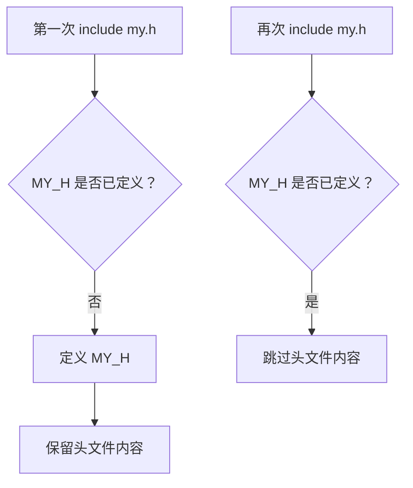
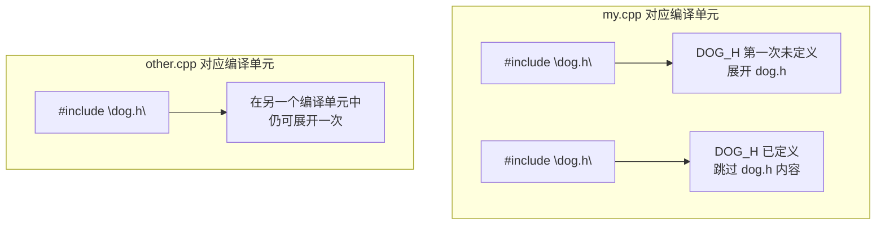

# 2.8 包含警戒

## 本节核心

本节讲[[包含警戒]]。它用于防止同一个头文件在同一个[[编译单元]]中被多次展开，从而避免类型、结构等内容发生[[重复定义]]。

> [!important] 核心认识
> `#include` 是文本展开。一个头文件可能通过直接包含或间接包含被展开多次；包含警戒保证其中的有效内容在一个编译单元中只出现一次。

## 为什么会重复包含

假设 `my.cpp` 中写了：

```cpp
#include "my.h"
#include "your.h"
```

而 `your.h` 中又写了：

```cpp
#include "my.h"
```

那么从 `my.cpp` 的角度看，`my.h` 会被包含两次：

1. `my.cpp` 直接包含一次。
2. `my.cpp` 包含 `your.h` 时，`your.h` 又间接包含一次。

预处理阶段会进行[[头文件展开]]，如果没有保护，`my.h` 的内容就可能在同一个编译单元中出现多次。

## 重复声明通常可以，重复定义不行

重复包含为什么会出错，要区分[[声明]]和[[定义]]。

例如，函数声明重复出现通常可以：

```cpp
void myFunc();
void myFunc();
```

`extern` 变量声明重复出现通常也可以：

```cpp
extern int a;
extern int a;
```

但类型定义重复出现通常会出错：

```cpp
struct A {
    int value;
};

struct A {
    int value;
};
```

即使两次写得完全一样，也仍然是重复定义。

> [!warning] 易错点
> “内容一样”不代表可以定义两次。编译器看到的是同一个名字被定义了两遍。

## 包含警戒的标准写法

经典包含警戒写法是：

```cpp
#ifndef MY_H
#define MY_H

// 头文件内容

#endif
```

其中：

- `#ifndef MY_H` 表示：如果还没有定义 `MY_H`。
- `#define MY_H` 表示：定义 `MY_H` 这个宏。
- 中间放真正的头文件内容。
- `#endif` 结束条件编译。

第一次包含时，`MY_H` 还没有定义，因此中间内容会保留。  
第二次包含时，`MY_H` 已经定义过，因此中间内容会被跳过。

## 包含警戒如何工作

可以把它理解成一次性开关：



最终效果是：无论 `my.h` 被包含多少次，它在当前编译单元中真正生效的内容最多只有一次。

## 包含警戒的本质作用

包含警戒的作用不是禁止你写多次 `#include`，而是让重复包含不会导致重复定义。

它允许：

- 同一个 `.cpp` 中多次包含同一个头文件。
- 多个头文件间接包含同一个头文件。
- 复杂工程中头文件依赖关系更安全。

最终目标是：

> [!summary] 本质目标
> 一个头文件的有效内容，在同一个编译单元中至多出现一次。

## 图示化理解：允许多处包含，但单元内只展开一次

包含警戒的边界很重要：



也就是说，包含警戒不是让头文件在整个工程中只能出现一次，而是让它在每个编译单元中最多有效一次。

这能解释两个常见现象：

- 很多 `.cpp` 都可以包含同一个头文件；
- 但同一个 `.cpp` 中通过直接或间接路径多次包含同一个头文件时，不会重复定义类或结构体。

`#pragma once` 与经典包含警戒在目的上相同，都是“本文件在当前编译单元中只处理一次”。课程基础复习时优先会写 `#ifndef/#define/#endif`，工程实践中也常见 `#pragma once`。

## 宏名如何命名

包含警戒中的宏名需要尽量唯一。

常见做法是根据文件名转换，例如：

| 文件名 | 宏名示例 |
|---|---|
| `my.h` | `MY_H` |
| `student.hpp` | `STUDENT_HPP` |
| `project/math/vector.h` | `PROJECT_MATH_VECTOR_H` |

宏名应是合法标识符，通常使用大写字母、数字和下划线，不使用点号。

> [!tip] 实践建议
> 在小项目中，用路径加文件名转换成大写宏名通常足够；大型项目中可以加项目前缀，减少冲突。

## IDE 生成的唯一标识

有些开发环境可能自动生成很长的唯一标识作为包含警戒宏，例如带有类似 GUID 的字符串。

它的目的仍然是保证宏名唯一。  
对初学者来说，不必记住 GUID 细节，只要知道：包含警戒宏名必须避免和其他头文件冲突。

## #pragma once

除了经典包含警戒，还可以看到：

```cpp
#pragma once

// 头文件内容
```

[[pragma once]]的作用也是让当前头文件在一个编译单元中只被包含一次。

它更短、更直观，现代编译器通常支持。但从可移植性和课程基础角度，经典 `#ifndef/#define/#endif` 写法更通用。

| 写法 | 优点 | 注意 |
|---|---|---|
| `#ifndef/#define/#endif` | 标准、通用、可移植性好 | 需要自己维护唯一宏名 |
| `#pragma once` | 简洁，不用命名宏 | 属于编译器指令，依赖编译器支持 |

## 本节和前面内容的联系

包含警戒建立在前几节知识上：

- `#include` 会在[[预编译]]阶段展开头文件。
- 一个 `.cpp` 加展开内容构成[[编译单元]]。
- 头文件通常包含声明、类型定义和[[前置声明]]。
- 类型定义如果重复展开，就可能导致编译错误。

因此，几乎每个自己写的头文件都应该加包含警戒。

## 本节考点整理

| 可能题型 | 可能问法 | 答题要点 |
|---|---|---|
| 名词解释 | 什么是包含警戒？ | 防止头文件在同一编译单元中被重复展开的预处理结构 |
| 选择题 | 包含警戒常用哪些预处理指令？ | `#ifndef`、`#define`、`#endif` |
| 判断题 | 同一个函数声明出现两次一定会报错。 | 错，重复声明通常可以 |
| 判断题 | 同一个结构定义出现两次通常会报错。 | 对，属于重复定义 |
| 简答题 | 包含警戒的本质作用是什么？ | 让头文件有效内容在同一编译单元中至多出现一次 |
| 选择题 | `#pragma once` 的作用是什么？ | 防止头文件重复包含 |
| 判断题 | 包含警戒宏名可以随便和其他头文件共用。 | 错，应尽量唯一 |

## 本节速记

> [!summary] 速记
> `#include` 是文本展开，头文件可能被直接或间接包含多次。重复声明通常没事，重复定义会出错。包含警戒用 `#ifndef/#define/#endif` 保证头文件内容在同一编译单元中只生效一次；`#pragma once` 是常见替代写法。
