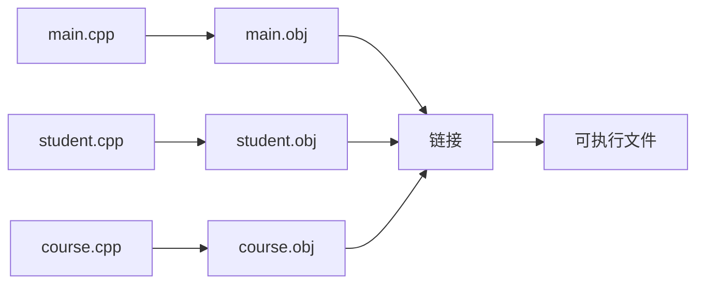

# 2.9 实现文件

## 本节核心

本节讲[[实现文件]]。实现文件通常是 `.cpp` 文件，是 C++ 工程中真正参与编译的基本单位之一。

> [!important] 核心认识
> `.cpp` 实现文件通常存放具体代码：函数定义、类成员函数实现、`main` 函数、算法逻辑等。它会作为[[编译单元]]参与编译。

## 实现文件是什么

实现文件常见扩展名：

- `.cpp`
- `.cc`
- `.cxx`
- `.C`

本课程主要使用 `.cpp`。

实现文件一般对应[[头文件]]中声明的接口，并给出具体实现。

例如：

```text
student.h    // 声明 Student 类或函数接口
student.cpp  // 实现 Student 相关函数
main.cpp     // 放 main 函数，组织程序执行
```

## 实现文件的常见结构

一个简单实现文件通常包含：

1. 包含需要的头文件。
2. 引入必要的名字空间或使用限定名。
3. 定义函数、类成员函数或 `main` 函数。
4. 编写具体执行逻辑。

例如：

```cpp
#include <iostream>

using namespace std;

int main() {
    int value = 0;

    cout << "Input an integer: ";
    cin >> value;
    cout << "value = " << value << endl;

    return 0;
}
```

## include 的作用

实现文件通常先写 `#include`。

常见目的包括：

- 使用标准库功能，例如 `<iostream>`。
- 使用自己工程中的头文件，例如 `"student.h"`。
- 让当前编译单元看到需要的[[声明]]。

例如：

```cpp
#include <iostream>
#include "student.h"
```

系统头文件通常用[[尖括号include]]，用户自定义头文件通常用[[双引号include]]。

## 名字空间

C++ 标准库中的很多名字位于 `std` [[名字空间]]中。

因此可以写：

```cpp
std::cout << "hello" << std::endl;
```

也可以在教学和简单示例中写：

```cpp
using namespace std;

cout << "hello" << endl;
```

课程前期常会使用 `using namespace std;` 来简化代码。后续工程中，通常更推荐根据场景使用 `std::` 限定，避免名字冲突。

## cin 和 cout

[[cin]] 和 [[cout]] 是 C++ 中常用的控制台输入输出对象。

| 对象 | 作用 | 常用运算符 |
|---|---|---|
| [[cin]] | 从标准输入读取数据 | `>>` |
| [[cout]] | 向标准输出打印数据 | `<<` |

示例：

```cpp
int n = 0;
cin >> n;
cout << n << endl;
```

与 C 语言常用的 `scanf`、`printf` 相比，本课程的 C++ 示例主要使用 `cin` 和 `cout`。

> [!tip] 初学者理解
> `cin >> n` 可以理解为“从输入流中取数据放进 n”；`cout << n` 可以理解为“把 n 送到输出流中显示”。

## 输入输出流

`cin` 和 `cout` 与[[输入输出流]]有关。

本课程当前阶段不深入讲流类体系，只要求能够看懂和使用基本输入输出：

```cpp
cin >> variable;
cout << expression << endl;
```

后续如果学习文件、流、运算符重载，会重新遇到这些概念。

## 多个实现文件

一个 C++ 工程可以有多个 `.cpp` 文件。

例如：

```text
main.cpp
student.cpp
course.cpp
```

每个 `.cpp` 文件通常会独立编译成自己的[[目标文件]]，再通过[[链接]]组合成最终程序。

这与前面讲过的模型一致：



## 命名风格

课程最后强调实现文件中的命名风格。

变量名、对象名、函数名、类型名都应尽量：

- 有意义。
- 风格一致。
- 避免过于随意的 `a`、`b`、`abc`。
- 避免同一工程中大小写规则混乱。

常见风格包括：

| 风格 | 示例 |
|---|---|
| 小驼峰 | `eatFood`、`studentName` |
| 大驼峰 | `StudentName`、`CourseManager` |
| 下划线 | `student_name`、`course_manager` |

> [!important] 实践建议
> 具体采用哪种风格不是最关键，关键是在同一个工程中保持一致。

## 本节和前面内容的关系

实现文件和头文件之间的关系：

- 头文件说明对外接口。
- 实现文件给出具体代码。
- 实现文件会包含需要的头文件。
- 每个实现文件通常是独立[[编译单元]]。
- 多个实现文件最后通过[[链接]]组合。

这也是第 2 章工程结构的落点。

## 本节考点整理

| 可能题型 | 可能问法 | 答题要点 |
|---|---|---|
| 选择题 | C++ 实现文件常见扩展名是什么？ | `.cpp` |
| 简答题 | 实现文件通常存放什么？ | 函数定义、类成员函数实现、`main`、具体逻辑 |
| 判断题 | `.cpp` 文件通常是 C++ 的基本编译单元。 | 对 |
| 选择题 | `cout` 用于什么？ | 标准输出 |
| 选择题 | `cin` 用于什么？ | 标准输入 |
| 判断题 | 本课程 C++ 示例主要使用 `printf/scanf`。 | 错，主要使用 `cout/cin` |
| 简答题 | 命名风格为什么重要？ | 提高可读性、可维护性，降低协作成本 |

## 本节速记

> [!summary] 速记
> 实现文件通常是 `.cpp`，用于写具体实现代码。一个工程可以有多个 `.cpp`，它们独立编译、最后链接。实现文件常包含头文件、使用 `cin/cout` 做基本输入输出，并应保持统一、清晰的命名风格。

