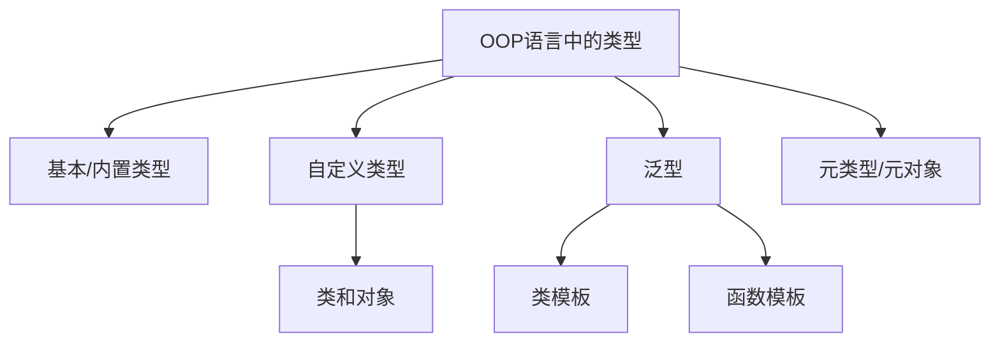

# 3.2 OOP中的类型

## 本节核心

本节在[[抽象数据类型]]的基础上，介绍面向对象程序设计语言中的几类常见类型。

面向对象语言并不一定把所有东西都完全当作抽象数据类型来实现。出于效率和工程实践考虑，现代语言通常会同时提供基本类型、自定义类型、泛型等机制。

> [!important] 核心认识
> 本课程后续重点关注[[自定义类型]]，也就是 C++ 中用类等机制定义出来的类型。

## 为什么不是所有类型都做成对象

理论上，很多面向对象语言可以把一切都看作对象或抽象数据类型。

例如 [[Smalltalk]] 就是非常典型的纯面向对象语言，很多概念都以对象方式组织。

但如果所有基本数据都按对象方式处理，程序效率可能较低。

因此，现代面向对象语言通常会保留一些[[基本类型]]或[[内置类型]]，例如：

- 整型。
- 字符型。
- 浮点型。
- 布尔型。

这些类型由语言或编译器直接支持，运行效率更高。

## 面向对象语言中的类型分类

课程中提到几类类型：

| 类型类别 | 含义 | 本课程关注程度 |
|---|---|---|
| [[基本类型]] / [[内置类型]] | 语言预先提供的类型，如整数、字符、浮点数 | 作为基础使用 |
| [[自定义类型]] | 程序员根据问题定义的类型，如类 | 重点 |
| [[泛型编程\|泛型]] | 以类型作为参数的类型或函数机制 | 后续涉及 |
| [[元类型]] / [[元对象]] | 类型本身的类型，部分语言支持 | 了解 |

## 基本类型

[[基本类型]]也称[[内置类型]]。

它们通常由语言直接提供，例如 C++ 中的：

```cpp
int
char
double
bool
```

基本类型不是本课程面向对象部分的重点，但它们会一直被使用。

> [!tip] 初学者理解
> 基本类型是语言提前准备好的“现成类型”；自定义类型是程序员根据问题自己设计出来的类型。

## 自定义类型

[[自定义类型]]是面向对象课程的重点。

在 C++ 中，自定义类型常通过：

- `class`
- `struct`
- `enum`

等方式定义。

面向对象程序设计主要关注用类来描述抽象数据类型：

| ADT 组成 | 类中的对应 |
|---|---|
| 数据 | 数据成员 |
| 操作 | 成员函数 |
| 不变式 | 类内部约束 |
| 具体表示 | 类的实现 |

后续课程会重点讲类、对象、构造函数、析构函数、成员函数、封装等内容。

## 泛型

[[泛型编程|泛型]]是一种“以类型作为参数”的机制，也可以理解为[[参数化类型]]。

例如，向量容器可以保存不同类型的数据：

```cpp
vector<int>
vector<double>
vector<string>
```

这里 `vector<T>` 中的 `T` 就像一个类型参数。

在 C++ 中，泛型主要通过[[模板]]实现，常见形式包括：

- [[类模板]]
- [[函数模板]]

> [!warning] 易混点
> 泛型编程和面向对象编程不是一回事。现代 C++ 同时支持两者，因此课程中都会遇到。

## 类模板与函数模板

[[类模板]]用于生成一族类。

例如：

```cpp
template <typename T>
class Box {
public:
    T value;
};
```

可以得到：

```cpp
Box<int>
Box<double>
```

[[函数模板]]用于生成一族函数。

例如：

```cpp
template <typename T>
T maxValue(T a, T b) {
    return a > b ? a : b;
}
```

这些内容属于后续泛型编程和模板部分。

## 元类型和元对象

[[元类型]]可以粗略理解为“类型的类型”。

例如：

- `1` 的类型可以是整数。
- `2` 的类型也可以是整数。
- 那么“整数”这个类型本身，又属于什么类型？

部分语言支持把类型本身当作对象处理，这就会涉及元类型或元对象。

课程语境中强调：C++ 本课程主线不重点讲这一类机制，主要了解概念即可。

## 本课程重点

本课程主要涉及：

- 基本类型：作为基础语法使用。
- 自定义类型：重点讲解。
- 泛型：后续会涉及模板、标准库等。

其中真正的面向对象核心，是自定义类型中的类和对象。



## 本节考点整理

| 可能题型 | 可能问法 | 答题要点 |
|---|---|---|
| 选择题 | OOP 语言中常见类型包括哪些？ | 基本类型、自定义类型、泛型、元类型等 |
| 判断题 | 本课程后续主要讲 C++ 自定义类型。 | 对 |
| 名词解释 | 什么是泛型？ | 以类型作为参数的类型或函数机制 |
| 判断题 | 泛型编程和面向对象编程完全相同。 | 错，它们是不同编程范型 |
| 选择题 | C++ 中泛型常通过什么实现？ | 模板 |
| 简答题 | 为什么现代 OOP 语言仍保留基本类型？ | 出于效率和工程实践考虑 |
| 判断题 | 元类型是本课程 C++ 主线重点。 | 错，主要了解 |

## 本节速记

> [!summary] 速记
> OOP 语言中的类型不只有类。现代语言通常有基本/内置类型、自定义类型、泛型，以及部分语言中的元类型。本课程后续重点是自定义类型，尤其是类和对象；泛型通过模板另行展开。

