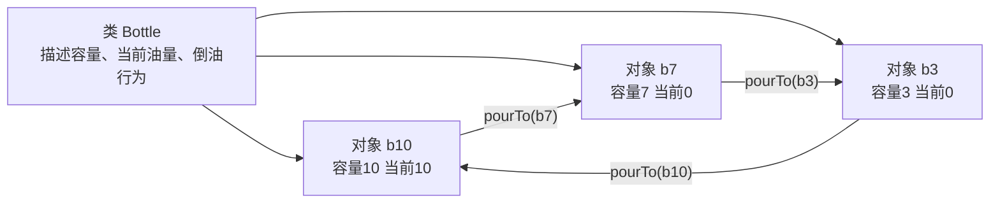

# 6.4 类和对象

## 本节核心

[[类]] 是类型，是抽象结果在 C++ 中的表示；[[对象]] 是类的实例，是程序运行时真正参与交互的实体。

程序运行时不是“类和类”在交互，而是“对象和对象”在交互。

## 类与对象的关系

类描述一类事物，对象是这一类事物中的具体个体。

例如：

- `int` 是类型，`1`、`2`、`3` 是具体值。
- `Student` 是类，张三、李四、王五是对象。
- `Bottle` 是类，10 斤瓶、7 斤瓶、3 斤瓶是对象。

一个类可以实例化出零个、一个或多个对象。

```cpp
class Student {
};

Student zhangSan;
Student liSi;
```

`zhangSan` 和 `liSi` 都是 `Student` 类的对象。

## C++ 中对象总是有类型

C++ 是 [[强类型语言]]。每一个对象都有明确类型，不存在“没有类型的对象”。

```cpp
int x;
Student s;
Bottle b;
```

`x` 的类型是 `int`，`s` 的类型是 `Student`，`b` 的类型是 `Bottle`。

理解对象时，必须同时理解它所属的类。

## 对象实例化

从类创建对象，称为 [[对象实例化]]。

基本形式类似定义变量：

```cpp
类名 对象名;
```

例如：

```cpp
Bottle b10;
```

如果需要参数，可以在创建对象时给出：

```cpp
Bottle b10(10, 10);
Bottle b7(7, 0);
Bottle b3(3, 0);
```

这里创建了三个 `Bottle` 对象。

## 栈上对象与堆上对象

对象可以直接创建在当前作用域中：

```cpp
Bottle b10(10, 10);
```

这种对象通常具有自动存储期，常说是在 [[栈区]] 创建。

也可以用 `new` 在 [[堆区]] 创建：

```cpp
Bottle* p = new Bottle(10, 10);
```

这时对象本身没有普通对象名，调用者通过指针 `p` 访问它。用 `new` 创建的对象需要配合 `delete` 释放：

```cpp
delete p;
```

## 不要把组成关系误认为类对象关系

判断“类和对象”关系时，要区分“某类的一个实例”和“整体的组成部分”。

正确例子：

- 学生 与 张三：张三是学生类的对象。
- 学院 与 计算机学院：计算机学院是学院类的对象。
- 菜单项 与 “退出”：退出可以是一个菜单项对象。

容易误判的例子：

- 学校 与 计算机学院：更像整体与组成部分，不是类与对象。
- 菜单 与 “退出”：菜单包含菜单项，“退出”不是菜单对象，而是菜单项对象。
- 书店 与 图书：书店包含图书，不是类与对象关系。

> [!tip] 判断方法
> 问一句：“后者是不是前者这一类东西的一个具体实例？”如果是，就是类与对象；如果只是前者的一部分，通常是组成关系。

## 对象之间通过访问发生交互

对象交互在代码中通常表现为对象访问和成员函数调用。

从面向对象语义上，更准确地说是：向对象发送消息。

```cpp
object.f(20);
```

这可以理解为：向 `object` 发送名为 `f`、参数为 `20` 的消息。

“发送消息”强调：调用者关注对象能响应什么行为，不关心对象内部如何完成。

## 三种对象访问形式

### 直接通过对象访问

```cpp
object.f(20);
```

使用 [[点运算符]] `.`。

### 通过引用访问

```cpp
MyClass& ref = object;
ref.f(99);
```

引用是对象的别名，访问形式仍然使用 `.`。

### 通过指针访问

```cpp
MyClass* p = &object;
p->f(66);
```

通过指针访问成员时使用 [[箭头运算符]] `->`。

## 瓶子例子：对象交互描述问题过程

假设有三个瓶子：

```cpp
Bottle b10(10, 10);
Bottle b7(7, 0);
Bottle b3(3, 0);
```

把 10 斤油分成两个 5 斤，可以通过对象消息描述：

```cpp
b10.pourTo(b7); // 3, 7, 0
b7.pourTo(b3);  // 3, 4, 3
b3.pourTo(b10); // 6, 4, 0
b7.pourTo(b3);  // 6, 1, 3
b3.pourTo(b10); // 9, 1, 0
b7.pourTo(b3);  // 9, 0, 1
b10.pourTo(b7); // 2, 7, 1
b7.pourTo(b3);  // 2, 5, 3
b3.pourTo(b10); // 5, 5, 0
```

这里的重点不是 `pourTo` 内部怎么实现，而是用对象行为清晰描述问题过程。

> [!important] 面向对象视角
> 面向对象程序不是先写一堆过程步骤，而是先找出对象，再让对象通过行为互相协作。

## 图示化理解：类、对象、消息

类与对象可以分三层理解：



这里 `Bottle` 只是类型描述，真正变化的是 `b10`、`b7`、`b3` 这些对象的状态。

所以写：

```cpp
b10.pourTo(b7);
```

不是“类调用类”，而是一个具体对象向另一个具体对象发起协作。面向对象程序的可读性，常常来自这种“对象 + 行为”的表达方式。

## 本节考点整理

- [[类]] 是类型，[[对象]] 是类的实例化结果。
- 程序运行时主要通过对象交互完成。
- C++ 中每个对象都有明确类型。
- 对象实例化形式类似变量定义。
- 对象可在栈上直接创建，也可用 `new` 在堆上创建。
- 要区分类对象关系和整体组成关系。
- 对象交互可以理解为向对象 [[发送消息]]。
- 对象访问有三类：对象访问、引用访问、指针访问。
- 对象和引用用 `.`，指针用 `->`。

## 本节速记

> 类是模板，对象是实例；  
> 程序运行靠对象交互；  
> 对象/引用点访问，指针箭头访问。
