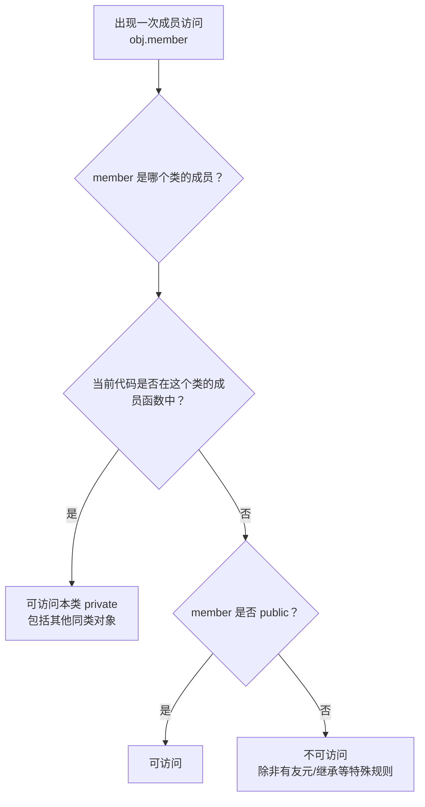

# 7.4 访问控制

## 本节核心

[[访问控制]] 用来规定类成员可以被谁访问。

C++ 类中常见访问控制关键字：

- [[public]]：公有，类外也可以访问。
- [[private]]：私有，只有本类可以访问。
- [[protected]]：保护，继承相关，后续再详细讲。

本节重点是 `public` 和 `private`。

## 访问控制的位置和顺序

访问控制标号可以按任意顺序出现：

```cpp
class A {
public:
    void f();

private:
    int x_;

public:
    void g();
};
```

也可以先写 `private` 再写 `public`。语法上没有固定顺序要求。

一个访问控制标号会影响它后面直到下一个访问控制标号之间的成员。

```cpp
class A {
public:
    void f(); // public

private:
    int x_;  // private
    void h(); // private
};
```

## public：类外可以访问

`public` 成员是类的外部接口。

```cpp
class Student {
public:
    void study();
};

int main() {
    Student s;
    s.study(); // 可以
}
```

类外代码能通过对象访问 `public` 成员。

在面向对象设计中，`public` 部分通常代表这个类型对外提供的行为。

## private：本类可以访问

`private` 成员不能被类外直接访问：

```cpp
class Student {
private:
    int score_;
    void otherFunc();
};

int main() {
    Student s;
    s.score_ = 100;   // 错误
    s.otherFunc();    // 错误
}
```

但在 `Student` 的成员函数内部，可以访问本类的私有成员：

```cpp
class Student {
public:
    void study() {
        score_ += 1;
        otherFunc();
    }

private:
    int score_ = 0;
    void otherFunc() {}
};
```

这里 `study` 是 `Student` 类的成员函数，所以可以访问 `Student` 的 `private` 成员。

## private 是本类访问，不是本对象访问

这是本节最容易考错的地方。

`private` 的含义是“本类可以访问”，不是“只能当前对象访问”。

因此，同一个类的成员函数可以访问另一个同类对象的私有成员。

```cpp
class Student {
public:
    void help(Student& other) {
        other.score_ += 1;   // 可以：other 也是 Student
        other.energy_ -= 2;  // 可以：同类对象的 private 成员
        other.otherFunc();   // 可以：同类对象的 private 成员函数
    }

private:
    int score_ = 0;
    int energy_ = 100;
    void otherFunc() {}
};
```

虽然 `other` 不是当前对象，但它的类型仍然是 `Student`。当前代码位于 `Student` 类的成员函数内部，所以可以访问 `Student` 类对象的私有成员。

> [!important] 考试判断
> 看访问是否允许，不是看“是不是同一个对象”，而是看“访问行为发生在哪个类的成员函数中，以及被访问成员属于哪个类”。

## 不能访问其他类的 private 成员

如果 `Student` 的成员函数访问 `Course` 的私有成员，就不允许：

```cpp
class Course {
public:
    int getDifficulty() const;

private:
    int terms() const;
    int difficulty_;
};

class Student {
public:
    void study(Course& course) {
        int d = course.getDifficulty(); // 可以：public
        int n = course.terms();         // 错误：Course 的 private
    }
};
```

`Student` 不是 `Course` 本类，所以不能访问 `Course` 的私有成员。

## 图示化判断：看访问发生在哪个类里

访问控制题不要只盯着对象名，要按下面顺序判断：



例如在 `Student::help(Student& other)` 中：

```cpp
other.score_ += 1;
```

虽然访问的是 `other`，不是 `this`，但访问行为发生在 `Student` 的成员函数里，`score_` 又是 `Student` 的成员，所以允许。

而在 `Student::study(Course& course)` 中：

```cpp
course.difficulty_ = 3;
```

如果 `difficulty_` 是 `Course` 的 `private` 成员，就不允许，因为当前代码不在 `Course` 的成员函数里。

## public 接口封装 private 数据

常见设计是：数据成员设为 `private`，通过 `public` 成员函数提供必要访问。

```cpp
class Course {
public:
    int getDifficulty() const {
        return difficulty_;
    }

private:
    int difficulty_;
};
```

外部不能直接操作 `difficulty_`，只能通过 `getDifficulty()` 获取。

这样做的好处是：

- 保护对象内部状态。
- 避免外部代码随意修改数据。
- 保持类的实现细节可变化。
- 对外只暴露稳定行为。

这就是 [[封装]] 的基础。

## protected 和不可访问成员

`protected` 与继承关系有关，表示本类和派生类可以访问，类外不能直接访问。课程后面讲 [[继承]] 时会详细展开。

还有一些继承语境下会出现的“不可访问”成员，本节只需要知道它们仍然是类的成员，只是当前上下文不能访问。

## 本节考点整理

- [[访问控制]] 控制成员能被谁访问。
- `public` 成员类外可访问。
- `private` 成员类外不可访问。
- `private` 是“本类可访问”，不是“本对象可访问”。
- 同类对象之间，在成员函数内部可以互相访问私有成员。
- 一个类不能访问另一个类的私有成员，除非有特殊机制如友元。
- 常见设计：数据成员设为 `private`，行为接口设为 `public`。
- `protected` 与继承相关，后续重点掌握。

## 本节速记

> `public` 给外部用，`private` 给本类用；  
> 私有看本类，不看本对象；  
> 同类可互访，异类不能碰。
