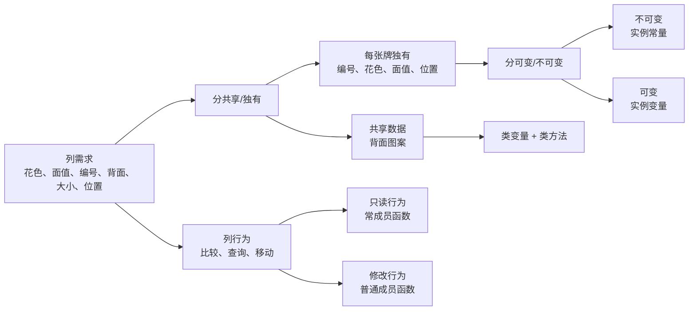

# 7.8 Card 类的定义和实现

## 本节核心

本节用扑克牌 `Card` 类演示如何从现实对象出发，设计一个 C++ 类。

关键不在于“把所有属性和操作列出来”，而在于判断：

- 哪些属性应该是 [[实例变量]]
- 哪些属性应该是 [[实例常量]]
- 哪些属性应该是 [[类变量]]
- 哪些操作应该是 [[实例方法]]
- 哪些操作应该是 [[类方法]]

> [!important] 高频考点
> 类设计时要根据语义决定成员归属：每张牌各不相同的属性放在对象中；所有牌共享的属性放在类中；不会改变当前对象的实例方法应写成 [[常成员函数]]。

## Card 类要描述什么

一张普通扑克牌至少有这些信息：

- 花色：黑桃、红心、方块、草花
- 面值：A、2、3、...、K
- 唯一编号：例如 0 到 51
- 背面图案
- 宽度和高度
- 屏幕坐标位置

它也有一些行为：

- 取得背面图案
- 设置背面图案
- 判断是否与另一张牌花色相同
- 判断是否与另一张牌面值相同
- 判断是否是给定花色
- 判断是否是给定面值
- 获取位置
- 设置位置
- 获取右下角坐标

这就是从问题域进入 [[类设计]] 的第一步：先列出对象的属性和行为。

## 不能把所有数据都写成实例变量

初学时容易把所有属性都写成普通数据成员。

例如：

```cpp
class Card {
private:
    int backImageId;
    int id;
    Suit suit;
    Rank rank;
    int width;
    int height;
    int x;
    int y;
};
```

这只是“列出来”，还不是好的类设计。

接下来要逐项判断它们的语义。

## 背面图案应该是类变量

一副牌中的 52 张牌通常共用同一个背面图案。

如果把 `backImageId` 写成实例变量，就表示：

> 每张牌都可以有自己的背面图案。

这与实际语义不太符合。

更合理的做法是把背面图案设计成 [[类变量]]：

```cpp
class Card {
public:
    static int getBackImageId();
    static void setBackImageId(int id);

private:
    static int backImageId_;
};
```

这样表示：背面图案属于整个 `Card` 类，所有牌共享同一份。

## 类变量需要类方法配套访问

既然背面图案是类变量，读取和设置背面图案的函数也应设计成 [[类方法]]。

```cpp
class Card {
public:
    static int getBackImageId() {
        return backImageId_;
    }

    static void setBackImageId(int id) {
        backImageId_ = id;
    }

private:
    static int backImageId_;
};
```

类方法没有隐含的 [[this指针]]，所以函数末尾不能写 `const`。

```cpp
static int getBackImageId() const; // 错误思路：static 成员函数没有 this
```

[[常成员函数]] 的 `const` 修饰的是 `this` 指针；而 [[静态成员函数]] 根本没有 `this`。

## 静态数据成员要在类外定义

类体中的静态数据成员声明通常不分配真正的存储空间。

```cpp
class Card {
private:
    static int backImageId_;
};
```

还需要在某个 `.cpp` 文件中定义：

```cpp
int Card::backImageId_ = 0;
```

如果缺少这一步，一旦程序实际访问 `Card::backImageId_`，就可能出现链接错误。

> [!warning] 易错点
> `static int backImageId_;` 写在类里通常只是声明；`int Card::backImageId_ = 0;` 才为这个类变量提供存储空间。

## id、花色、面值应是实例常量

每张牌都有自己的唯一编号、花色和面值，所以它们属于对象。

但它们不应该在牌的生命周期中随意改变。

例如一张黑桃 A 不应玩着玩着变成红心 5。

因此，这些成员更适合设计成 [[实例常量]]：

```cpp
class Card {
private:
    const int id_;
    const Suit suit_;
    const Rank rank_;
};
```

含义是：

- 每张牌有自己的 `id_`、`suit_`、`rank_`
- 对象创建后，这些值保持不变
- 这比普通实例变量更符合扑克牌的语义

## 宽度、高度和位置可以是实例变量

牌的宽度、高度、坐标位置可以随着界面缩放、动画或布局调整而变化。

因此它们可以设计成 [[实例变量]]：

```cpp
class Card {
private:
    int width_;
    int height_;
    int x_;
    int y_;
};
```

它们属于每张牌，而且在对象生命周期中允许修改。

## 花色和面值适合用枚举表示

花色和面值都是有限集合，适合用 [[枚举]] 表示。

在 C++11 之后，更推荐使用 [[强类型枚举]]：

```cpp
enum class Suit {
    Clubs,
    Diamonds,
    Hearts,
    Spades
};

enum class Rank {
    Ace,
    Two,
    Three,
    // ...
    King
};
```

`enum class` 的好处是类型更安全，不容易与普通整数混用。

如果要用枚举值作为数组下标，通常需要显式转换：

```cpp
static_cast<int>(suit_)
```

原因是强类型枚举通常不能隐式转换为整数。

## 返回花色名和面值名

可以为 `Card` 提供读取花色名和面值名的实例方法：

```cpp
class Card {
public:
    const char* suitName() const;
    const char* rankName() const;
};
```

它们只是读取当前对象的花色和面值，不改变对象，因此应该写成 [[常成员函数]]。

一种常见实现是使用静态局部数组：

```cpp
const char* Card::suitName() const {
    static const char* names[] = {"C", "D", "H", "S"};
    return names[static_cast<int>(suit_)];
}
```

这里的 `names` 是 [[静态局部变量]]：

- 第一次执行到定义处时初始化。
- 后续调用不反复创建数组。
- 作用域仍局限在函数内部。
- 生命周期通常持续到程序结束。

如果不写 `static`，每次调用函数都要重新创建局部数组，效率和语义都不如静态局部数组清晰。

## 判断函数适合写成内联常成员函数

判断是否相同花色、相同面值的函数通常很短，可以写成 [[内联实现]]。

```cpp
class Card {
public:
    bool hasSameSuit(const Card& other) const {
        return suit_ == other.suit_;
    }

    bool hasSameRank(const Card& other) const {
        return rank_ == other.rank_;
    }

    bool isSuit(Suit suit) const {
        return suit_ == suit;
    }

    bool isRank(Rank rank) const {
        return rank_ == rank;
    }
};
```

这些函数都不修改当前对象，所以函数末尾应加 `const`。

参数 `const Card& other` 的含义是：

- 用引用避免复制整张牌对象。
- 用 `const` 表示不会修改传入的另一张牌。

这也体现了前面学过的 [[const和引用]]。

## 设置位置和获取位置

设置坐标会改变当前对象，因此不是常成员函数：

```cpp
void setPosition(int x, int y) {
    x_ = x;
    y_ = y;
}
```

获取坐标不改变当前对象，可以写成常成员函数：

```cpp
Point position() const {
    return Point{x_, y_};
}
```

获取右下角坐标也只是计算结果，不修改当前对象：

```cpp
Point rightBottom() const {
    return Point{x_ + width_, y_ + height_};
}
```

这里返回的是一个新构造的 `Point` 对象。

## 一个更合理的 Card 设计骨架

综合上面的分析，可以得到一个更合理的结构：

```cpp
class Card {
public:
    enum class Suit { Clubs, Diamonds, Hearts, Spades };
    enum class Rank { Ace, Two, Three, Four, Five, Six, Seven,
                      Eight, Nine, Ten, Jack, Queen, King };

    static int getBackImageId();
    static void setBackImageId(int id);

    const char* suitName() const;
    const char* rankName() const;

    bool hasSameSuit(const Card& other) const;
    bool hasSameRank(const Card& other) const;
    bool isSuit(Suit suit) const;
    bool isRank(Rank rank) const;

    void setPosition(int x, int y);
    Point position() const;
    Point rightBottom() const;

private:
    static int backImageId_;

    const int id_;
    const Suit suit_;
    const Rank rank_;

    int width_;
    int height_;
    int x_;
    int y_;
};
```

这不是唯一答案，但它展示了类设计时的判断过程。

## 图示化设计流程：从需求到成员归属

`Card` 例子的价值在于展示类设计流程，而不是背某一份代码。



考试或作业中遇到类似“设计一个类”的题，可以套这个顺序：

1. 先列对象有哪些属性和行为；
2. 判断属性属于“每个对象独有”还是“所有对象共享”；
3. 判断独有属性创建后是否允许变化；
4. 判断行为是否修改当前对象；
5. 再决定使用实例变量、实例常量、类变量、实例方法、类方法和常成员函数。

这个流程比直接写成员列表更可靠，也能解释为什么同样是 `int`，有些应该是普通成员，有些应该是 `static`，有些应该是 `const`。

## 本节考点整理

- 设计类时，先列出属性和行为，再判断成员归属。
- 所有对象共享的数据应设计成 [[类变量]]。
- C++ 中类变量通常用 [[静态数据成员]] 表示。
- 访问类变量的函数通常设计成 [[类方法]]。
- C++ 中类方法通常用 [[静态成员函数]] 表示。
- 静态成员函数没有 [[this指针]]，不能写成员函数末尾的 `const`。
- 静态数据成员通常需要在 `.cpp` 文件中类外定义。
- 每个对象独有且创建后不该变化的数据适合设计成 [[实例常量]]。
- 每个对象独有且运行中允许变化的数据适合设计成 [[实例变量]]。
- 只读取当前对象的实例方法应写成 [[常成员函数]]。
- 有限取值集合适合用 [[枚举]] 或 [[强类型枚举]] 表示。
- 强类型枚举作为数组下标时常需要 `static_cast<int>`。
- 函数内反复使用的固定表可以考虑 [[静态局部变量]]。
- 短小判断函数可以考虑 [[内联实现]]。

## 本节速记

> 共享背面图案：类变量；  
> 固定牌号、花色、面值：实例常量；  
> 可变大小、位置：实例变量；  
> 只读函数加 `const`，类方法不加函数尾 `const`。
