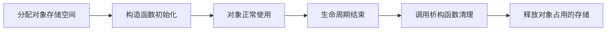

# 8.4 析构函数

## 本节核心

[[析构函数]] 是对象即将被销毁时自动调用的特殊成员函数。

它与 [[构造函数]] 相对应：

- 构造函数：对象从无到有，用于创建和初始化。
- 析构函数：对象从有到无，用于释放和清理。

析构函数的基本形式是：

```cpp
class A {
public:
    ~A();
};
```

> [!important] 高频考点
> 析构函数名是在类名前加 `~`，没有返回值，没有参数，不能重载；用户不写时，编译器会提供缺省析构函数。

## 析构函数的语法格式

构造函数：

```cpp
A();
```

析构函数：

```cpp
~A();
```

二者都没有返回值类型。

析构函数比构造函数多一个 `~`，读作“析构 A 对象”。

## 析构函数没有参数

析构函数不能带参数：

```cpp
class A {
public:
    ~A(int value); // 错误
};
```

原因是析构函数由对象销毁过程自动调用，调用时只需要销毁当前对象，不需要用户再传入额外参数。

这也意味着析构函数不能像构造函数那样重载。

## 析构函数没有返回值

析构函数也没有返回值类型：

```cpp
class A {
public:
    ~A();      // 正确
    void ~A(); // 错误
};
```

它的职责是清理对象，不通过返回值表达结果。

## 析构函数不能是 const

析构函数不能写成 [[常成员函数]]：

```cpp
class A {
public:
    ~A() const; // 错误
};
```

原因是析构函数的本意就是销毁当前对象。销毁对象显然会改变对象状态，不可能承诺“不修改当前对象”。

同理，构造函数也不能是 `const`。

## 构造函数和析构函数都有 this 指针

构造函数和析构函数内部都有隐含的 [[this指针]]。

因此，它们可以访问当前对象的数据成员：

```cpp
class A {
public:
    A() {
        value_ = 0;
    }

    ~A() {
        value_ = 0;
    }

private:
    int value_;
};
```

只是要注意：构造函数处于对象创建过程，析构函数处于对象销毁过程，二者的语义不同。

## 缺省析构函数

如果用户没有写析构函数，编译器会提供 [[缺省析构函数]]。

缺省析构函数会负责按照语言规则销毁对象成员。

例如：

```cpp
class Card {
private:
    int x_;
    int y_;
    int id_;
    Player& player_;
    SomeObject object_;
};
```

如果没有手写析构函数：

- `int` 成员不需要特殊清理。
- 引用成员本身不负责销毁被引用对象。
- 对象成员会自动调用它自己的析构函数。

因此很多类不需要显式写析构函数。

## 什么时候需要自定义析构函数

如果类本身没有管理特殊资源，通常不需要手写析构函数。

需要考虑自定义析构函数的常见情况包括：

- 类中直接管理动态内存。
- 类中持有文件句柄、网络连接、锁等资源。
- 类需要在对象销毁时记录日志、注销状态或归还资源。

当前课程这一节主要强调语法和默认行为，资源管理的复杂问题会在后续章节逐渐展开。

## 析构对象成员

一个对象中如果包含其他对象作为成员：

```cpp
class A {
private:
    B b_;
};
```

当 `A` 对象析构时，`b_` 会自动调用 `B` 的析构函数。

这说明：缺省析构函数不是“什么都不做”，它会按规则处理成员对象的销毁。

## 图示化理解：析构是对象销毁前的最后清理

析构函数可以理解为对象生命周期的终点动作：



对于下面的类：

```cpp
class Card {
public:
    ~Card();

private:
    int x;
    int y;
    const int id;
    Player& player;
    Description desc;
};
```

析构函数通常不需要处理 `int`、`const int` 这类普通成员；引用成员也不负责销毁被引用对象。真正需要关注的是成员对象 `desc`，它会自动调用自己的析构函数；如果类中直接管理动态内存或外部资源，才需要在析构函数中显式清理。

## 本节考点整理

- [[析构函数]] 在对象释放时调用。
- 析构函数名是 `~类名`。
- 析构函数没有返回值。
- 析构函数没有参数。
- 析构函数不能重载。
- 析构函数不能写成 `const`。
- 构造函数和析构函数内部都有 [[this指针]]。
- 用户不写析构函数时，编译器提供 [[缺省析构函数]]。
- 缺省析构函数会自动析构对象成员。
- 没有特殊资源管理需求时，不必强行写析构函数。
- 析构函数一般设为 `public`，继承场景中有时会设为 `protected`。

## 本节速记

> 构造：对象出生；  
> 析构：对象销毁；  
> `~类名()`，无参、无返回、不能 `const`。
