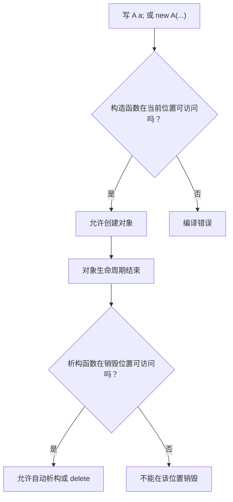

# 8.5 构造和析构函数的访问

## 本节核心

对象的创建和销毁分别由 [[构造函数]] 和 [[析构函数]] 处理。

这一节重点理解三件事：

- 构造函数什么时候被调用。
- 析构函数什么时候被调用。
- 成员对象的构造和析构顺序。

> [!important] 高频考点
> 成员对象按声明顺序构造，按构造的逆序析构；栈区对象离开作用域自动析构，堆区对象需要 `delete` 才会触发析构。

## 构造函数的调用场景

构造函数主要在对象创建时调用。

常见情况包括：

- 显式创建对象。
- 隐式类型转换创建临时对象。
- 成员对象随外层对象一起创建。
- 静态数据成员在类外定义并初始化。
- `new` 在堆区创建对象。

## 显式调用构造函数

显式调用就是代码明确表达要创建某个类型的对象：

```cpp
A a0;
A a1(5);
```

这类写法会直接根据参数选择构造函数。

## 隐式调用构造函数

如果构造函数允许隐式转换，编译器可能自动调用构造函数创建临时对象。

```cpp
class B {
public:
    B(int value);
};

void f(B b);

f(2); // 可能隐式构造 B(2)
```

如果构造函数加了 [[explicit关键字]]：

```cpp
class B {
public:
    explicit B(int value);
};
```

则 `f(2)` 不能再隐式把 `2` 转成 `B` 对象。

## 对象成员的构造

如果类 `A` 中包含 `B` 类型成员：

```cpp
class A {
private:
    int number_;
    B b1_;
    B b2_;
};
```

创建 `A` 对象时，`b1_` 和 `b2_` 也必须被构造。

此时可以使用 [[构造函数初始化列表]] 指定它们的构造方式：

```cpp
A::A()
    : number_(0),
      b2_(2)
{
}
```

如果某个成员没有在初始化列表中出现，编译器会尝试调用它的无参构造函数。

## 成员构造顺序由声明顺序决定

成员的实际构造顺序由它们在类中的声明顺序决定，不由初始化列表书写顺序决定。

```cpp
class A {
private:
    int number_;
    B b1_;
    B b2_;
};
```

构造顺序是：

1. `number_`
2. `b1_`
3. `b2_`

即使初始化列表写成：

```cpp
A::A() : b2_(2), number_(0) {}
```

实际构造仍按声明顺序进行。

> [!warning] 易错点
> 初始化列表不是决定成员构造顺序的依据；类中成员声明顺序才是依据。

## 构造函数体执行前，成员已经构造

构造 `A` 对象时，流程大致是：

1. 按声明顺序构造各个数据成员。
2. 使用初始化列表提供的参数或默认构造方式。
3. 成员构造完成后，进入构造函数体 `{}`。

因此，构造函数体不是成员构造开始的地方，而是成员已经构造后执行额外语句的地方。

这与 [[对象初始化]] 中“函数体内赋值不是初始化”的观点一致。

## 析构函数的调用场景

析构函数在对象生命周期结束时调用。

对象在哪里创建，通常决定了它什么时候销毁。

| 对象位置 | 销毁时机 | 是否自动析构 |
|---|---|---:|
| 程序区或全局/静态存储区 | 程序结束时 | 是 |
| 栈区 | 离开作用域或函数结束时 | 是 |
| 堆区 | 执行 `delete` 时 | 需要用户触发 |

## 栈区对象自动析构

局部对象通常位于 [[栈区]]：

```cpp
void f() {
    A a1;
    A a2(5);
} // 离开作用域，a2、a1 自动析构
```

离开作用域时，会自动调用析构函数。

局部对象一般按照创建的逆序析构：后创建的先销毁。

## 堆区对象需要 delete

用 `new` 创建的对象位于 [[堆区]]：

```cpp
A* pa = new A(5);
delete pa;
```

`new A(5)` 会：

- 在堆区分配空间。
- 调用 `A` 的构造函数。
- 返回对象地址。

`delete pa` 会：

- 调用 `pa` 指向对象的析构函数。
- 释放堆区空间。

注意：`pa` 这个指针变量本身如果是局部变量，仍然在栈上；堆上的是它指向的对象。

## 图示化理解：创建看构造可访问，销毁看析构可访问

对象能否被创建，首先要看当前位置能否访问对应构造函数；对象能否被销毁，也要看当前位置能否访问析构函数。



这也是私有构造函数、私有析构函数能控制对象创建和销毁方式的原因。

常见判断：

| 写法 | 需要访问 |
|---|---|
| `A a;` | 构造函数；离开作用域时还要能访问析构函数 |
| `A* p = new A;` | 构造函数 |
| `delete p;` | 析构函数 |
| 成员对象 `B b;` | 外层对象构造/析构时能按规则调用 `B` 的构造/析构 |

## 析构顺序与构造顺序相反

如果 `A` 中有成员 `b1_`、`b2_`：

```cpp
class A {
private:
    int number_;
    B b1_;
    B b2_;
};
```

构造 `A` 时：

1. 构造 `number_`
2. 构造 `b1_`
3. 构造 `b2_`
4. 执行 `A` 构造函数体

析构 `A` 时：

1. 执行 `A` 析构函数体
2. 析构 `b2_`
3. 析构 `b1_`
4. 普通整数成员无需特殊析构

这就是 [[构造顺序]] 与 [[析构顺序]] 的对应关系。

## 静态数据成员对象的构造

如果类中有静态对象成员：

```cpp
class A {
private:
    static B globalB_;
};

B A::globalB_(200);
```

`globalB_` 是 [[静态数据成员]]，通常在类外定义并初始化。

它存放在静态存储区域，不属于某个 `A` 对象。

程序结束时，它也会被析构。

## 本节考点整理

- [[构造函数]] 用于对象创建。
- [[析构函数]] 用于对象销毁。
- 构造函数可以显式调用，也可能因隐式转换被调用。
- [[explicit关键字]] 可禁止隐式构造转换。
- 成员对象创建时也会调用其构造函数。
- [[构造函数初始化列表]] 用于指定成员构造方式。
- 成员构造顺序由类中声明顺序决定。
- 构造函数体执行前，成员已经构造完成。
- 程序区或全局/静态对象在程序结束时析构。
- [[栈区]] 对象离开作用域自动析构。
- [[堆区]] 对象需要 `delete` 触发析构。
- `delete` 既调用析构函数，也释放堆区对象空间。
- 成员析构顺序与构造顺序相反。
- 指针变量本身和它指向的对象可能位于不同存储区域。

## 本节速记

> 构造看声明顺序；  
> 析构反着来；  
> 栈上自动走，堆上要 `delete`。
